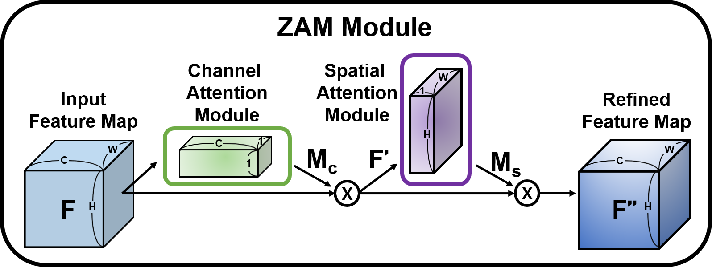
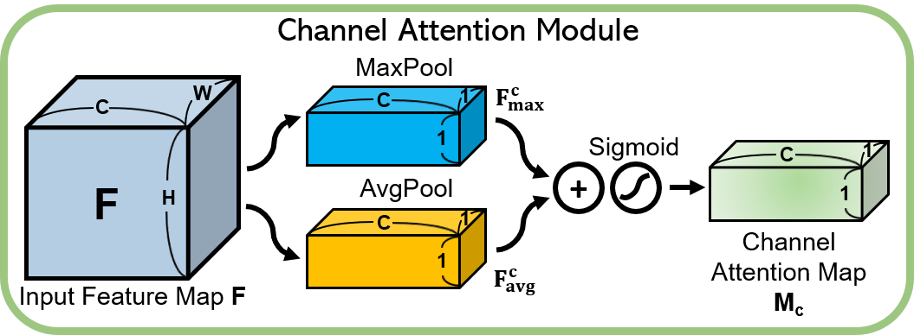
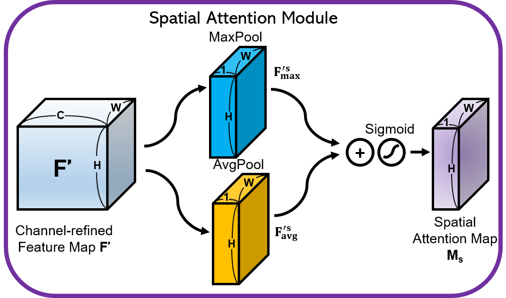
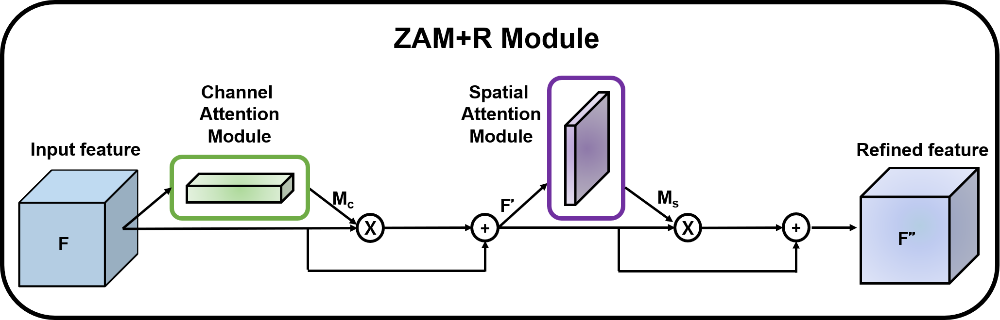

# ZAM
ZAM: Zero parameter Attention Module

It is ispired from [CBAM](https://arxiv.org/pdf/1807.06521.pdf) and [BAM](https://arxiv.org/abs/1807.06514). 

My work is motivated by the following one question.

Is it possible to improve performance of CNNs using attention module that has no additional parameters(weight and bias)?

## ZAM Module



Yeah... I know... my drowing skills are very good. 

If you know the way to draw beautipul cube with gradient using PPT or other tools, tell me about that. 

### ZCA: Channel Attention Module in ZAM



### ZSA: Spatial Attention Module in ZAM



### Residual Units


## ZAM+R Module



### Depthwise Separable convolutions with ZAM+R


## Experimental Results

### Dataset: CIFAR- 100

This dataset is just like the [CIFAR-10](https://www.cs.toronto.edu/~kriz/cifar.html), except it has 100 classes containing 600 images each. There are 500 training images and 100 testing images per class. The 100 classes in the CIFAR-100 are grouped into 20 superclasses. Each image comes with a "fine" label (the class to which it belongs) and a "coarse" label (the superclass to which it belongs).

### Training Rules

Epochs: 200

Batch Size: 128

Learning Rate:
- 0.1, if epoch < 60
- 0.1 * 0.2^1, if 60 <= epoch < 120
- 0.1 * 0.2^2, if 120 <= epoch < 160
- 0.1 * 0.2^3, if epoch >= 160

### Resnet18

| Model| Param.| Acc1.| Acc2.| Acc3.| Acc4.| Acc5.| Best Acc.| Avg Acc.|
| ----------------- | ----------- | ----------- | ----------- | ----------- | ----------- |----------- |----------- |----------- |
| ResNet18 | 11.22M      | 76.36%      | 75.94%      | 76.38%      | 76.03%      |76.37%      |76.38%      |76.22% |
| with CBAM |11.39M     |  76.20% | 76.55%      |       76.23%| 76.26%      |76.16%      |76.55%      |76.28% |
| with ZAM(Max) |  11.22M     | 75.64% | 75.97%|       76.20%| 75.99%      | 75.87%      |76.20%      |75.93%|
| with ZAM(Avg) |  11.22M     | 76.89% | 76.77%|       76.51%| 76.45%      | 76.68%      |76.89%      |**76.66%**|
| with ZAM(Avg&Max) |  **11.22M**     | 76.46% |       76.95%|       76.62%| 76.34%      |76.12%      |**76.95%**      |76.50%|

The total number of parameters of resnet18 with ZAM is the same as resnet18, but the resnet18 with ZAM outperformes resnet18 in terms of the accuracy and overall overhead of ZAM is quite small in terms of computation too.

This motivates me to apply ZAM to the light-weight network, MobileNet.

### MobileNet

| Model| Param.| Acc1.| Acc2.| Acc3.| Acc4.| Acc5.| Best Acc.| Avg Acc.|
| ----------------- | ----------- | ----------- | ----------- | ----------- | ----------- |----------- |----------- |----------- |
| MobileNet |   3.3M  | 73.03%      | 72.92%      | 73.08%      | 72.89%      | 72.83%      |73.08%      |72.95% |
| with CBAM |   4.3M  |  75.65% | 75.11%      |  75.07%| 74.98%      |75.34%      |**75.65%**      |**75.23%**|
| with ZAM |  3.3M    | 71.11% | 71.74%|       71.61%| 71.09%      |71.75%      |71.75%      |71.46%|
| with ZAM+R | **3.3M**     | 73.59% |  73.44%|  73.68%| 73.27%| 73.51%|73.68%      |73.50%|


## Run

```
python train.py -net resnet18
python train.py -net resnetcbam18
python train.py -net resnetzam18
python train.py -net mobilenet
python train.py -net mobilenetcbam
python train.py -net mobilenetzam
``` 

## Reference

- Paper: [CBAM: Convolutional Block Attention Module](https://arxiv.org/pdf/1807.06521)
- Paper: [BAM: Bottleneck Attention Module](https://arxiv.org/abs/1807.06514)
- Paper: [Deep Residual Learning for Image Recognition](https://arxiv.org/abs/1512.03385)
- Paper: [MobileNets: Efficient Convolutional Neural Networks for Mobile Vision Applications](https://arxiv.org/abs/1704.04861)
- Repository: [Jongchan/attention-module](https://github.com/Jongchan/attention-module)
- Repository: [luuuyi/CBAM.PyTorch](https://github.com/luuuyi/CBAM.PyTorch)
- Repository: [kobiso/CBAM-tensorflow](https://github.com/kobiso/CBAM-tensorflow)
- Repository: [weiaicunzai/pytorch-cifar100](https://github.com/weiaicunzai/pytorch-cifar100)
- Repository: [marvis/pytorch-mobilenet](https://github.com/marvis/pytorch-mobilenet)
- Dataset: [CIFAR-100](https://www.cs.toronto.edu/~kriz/cifar.html)

